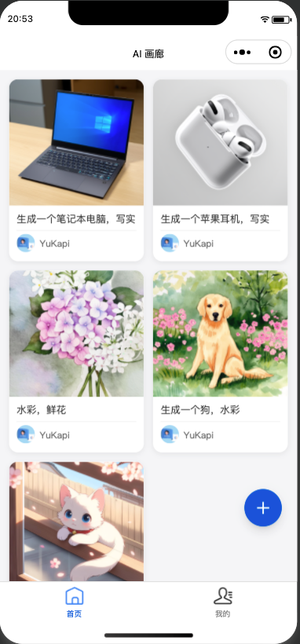
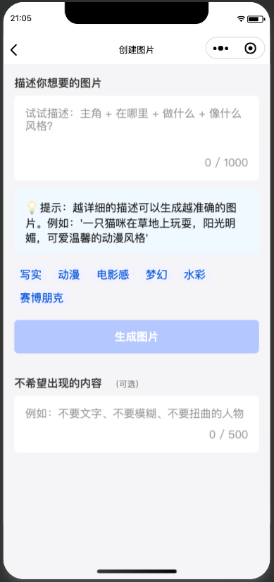
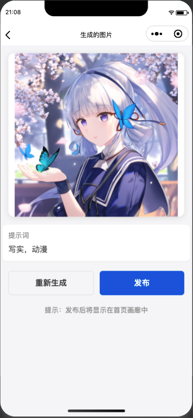

# AI 画廊小程序

## 🎨 项目概述

**AI 画廊**是一款基于微信小程序的创意绘画应用，让用户通过文字描述即可生成精美的 AI 画作，并分享到社区画廊中展示交流。

<p align="center">
  <a href="#✨-核心功能"><strong>✨ 核心功能</strong></a> ·
  <a href="#🎯-产品特色"><strong>🎯 产品特色</strong></a> ·
  <a href="#🖼️-界面设计"><strong>🖼️ 界面设计</strong></a> ·
  <a href="#🚀-快速部署"><strong>🚀 快速部署</strong></a> ·
  <a href="#💻-开发指南"><strong>💻 开发指南</strong></a> ·
  <a href="#🛠️-技术架构"><strong>🛠️ 技术架构</strong></a> ·
  <a href="#📁-项目结构"><strong>📁 项目结构</strong></a>
</p>
<br/>


## ✨ 核心功能

### 底部导航栏
- **首页** - 浏览社区画廊，欣赏其他用户的 AI 画作
- **我的** - 个人中心，管理自己的作品和账户

### 首页画廊
- **无限滚动** - 支持下拉刷新和上拉加载更多
- **社区展示** - 查看所有用户公开发布的 AI 画作
- **快速创作** - 右下角悬浮"+"按钮直达创作页面

### 用户系统
- **微信一键登录** - 便捷的微信授权登录
- **个人画廊** - 展示用户自己的所有作品
- **退出登录** - 安全的账户登出功能

### AI 创作系统
- **文生图功能** - 基于文字描述生成 AI 画作
- **智能提示词** - 提供创作灵感和优化建议
- **画布发布** - 将满意的作品发布到社区画廊

## 🎯 产品特色

### 🎨 创意无限
- **零基础绘画** - 无需绘画技巧，文字描述即可创作
- **多样风格** - 支持多种艺术风格和画风选择
- **实时生成** - 快速响应，即刻看到创作成果

### 👥 社交互动
- **社区画廊** - 展示交流，激发创作灵感
- **作品分享** - 一键分享到微信好友和朋友圈
- **灵感碰撞** - 查看他人提示词，学习创作技巧

### ⚡ 技术优势
- **云端计算** - 基于腾讯云 CloudBase 的稳定服务
- **智能优化** - AI 模型持续优化，生成质量不断提升
- **流畅体验** - 微信原生框架，操作流畅响应迅速

## 🖼️ 界面设计

### 设计规范
- **UI 框架**: TDesign Weixin 组件库
- **设计风格**: 简洁现代，突出内容展示
- **交互体验**: 符合微信小程序设计规范

### 主要页面预览

| 首页画廊 | 创作页面 | 重新生成 |个人中心 |
|---------|---------|---------|---------|
|  | | ||

## 🚀 快速部署

### 腾讯云 CloudBase 部署（推荐）

https://console.cloud.tencent.com/tcb

**一键部署步骤：**
1. 进入 https://console.cloud.tencent.com/tcb
2. 选择「微信小程序」模板
3. 上传本项目代码
4. 配置环境变量和云函数
5. 部署完成，获取小程序体验版

### 手动部署流程

```bash
# 1. 克隆项目
git clone [项目仓库地址]
cd ai-gallery-miniprogram

# 2. 安装依赖
npm install

# 3. 配置云开发环境
# 在 project.config.json 中配置云函数目录和环境ID

# 4. 上传云函数
tcb functions:deploy -e [环境ID]

# 5. 微信开发者工具中预览
```

## 💻 开发指南

### 环境要求
- **微信开发者工具** 最新版本
- **Node.js** 14.0+
- **腾讯云 CloudBase** 账户
- **微信小程序** 开发者资质

### 本地开发

1. **初始化项目**
```bash
# 使用微信小程序 TS 模板
npm init miniprogram --template typescript
```

2. **安装 TDesign 组件库**
```bash
npm install tdesign-miniprogram
```

3. **配置 app.json**
```json
{
  "usingComponents": {
    "t-button": "tdesign-miniprogram/button/button",
    "t-input": "tdesign-miniprogram/input/input"
  }
}
```

4. **开发调试**
```bash
# 启动微信开发者工具
# 选择本项目目录进行预览
```

### 云函数开发

**AI 绘画云函数示例：**
```javascript
// cloudfunctions/ai-painting/index.js
const cloud = require('wx-server-sdk')
cloud.init()

exports.main = async (event) => {
  const { prompt, style } = event
  
  // 调用 AI 绘画 API
  const result = await cloud.callFunction({
    name: 'ai-painting-api',
    data: { prompt, style }
  })
  
  return {
    success: true,
    imageUrl: result.imageUrl,
    prompt: prompt
  }
}
```

## 🛠️ 技术架构

### 前端技术栈
- **框架**: 微信小程序原生框架 + TypeScript
- **UI 组件**: TDesign Weixin 组件库
- **状态管理**: 小程序全局 App 数据
- **网络请求**: wx.request + 云函数调用

### 后端服务
- **云开发**: 腾讯云 CloudBase
- **数据库**: CloudBase 数据库
- **存储服务**: CloudBase 存储
- **云函数**: 业务逻辑处理

### AI 服务集成
- **文生图 API**: 集成主流 AI 绘画服务
- **提示词优化**: 智能提示词建议和优化
- **画质增强**: 图片后处理和优化

## 📁 项目结构

```
ai-gallery-miniprogram/
├── cloudfunctions/          # 云函数目录
│   ├── generate-image/     # AI图片生成函数
│   ├── publish-work/       # 作品发布函数
│   ├── user-login/         # 用户登录函数
│   └── get-gallery/        # 画廊数据获取函数
├── miniprogram/            # 小程序前端代码
│   ├── pages/              # 页面目录
│   │   ├── index/          # 首页-画廊社区
│   │   ├── create/         # 创作页面
│   │   ├── profile/        # 个人中心
│   │   └── detail/         # 作品详情页
│   ├── components/         # 公共组件
│   │   ├── gallery-item/   # 画廊作品项
│   │   ├── prompt-input/   # 提示词输入组件
│   │   ├── loading/        # 加载组件
│   │   └── empty-state/    # 空状态组件
│   ├── utils/              # 工具函数
│   │   ├── api.ts          # API接口封装
│   │   ├── auth.ts         # 登录授权
│   │   ├── cloud.ts        # 云服务封装
│   │   └── validator.ts    # 数据验证
│   ├── config/             # 配置文件
│   │   ├── config.ts       # 项目配置
│   │   └── constants.ts    # 常量定义
│   ├── types/              # TypeScript类型
│   │   ├── global.d.ts     # 全局类型
│   │   ├── user.d.ts       # 用户相关类型
│   │   └── work.d.ts       # 作品相关类型
│   ├── styles/             # 样式文件
│   │   ├── common.wxss     # 公共样式
│   │   └── tdesign.wxss    # TDesign样式
│   ├── app.ts              # 小程序入口
│   ├── app.json            # 小程序配置
│   └── app.wxss            # 全局样式
├── project.config.json     # 项目配置文件
├── package.json            # 依赖管理
├── tsconfig.json          # TypeScript配置
└── README.md              # 项目说明
```

## 🎨 功能详细说明

### 首页画廊功能
```typescript
// 页面数据结构
interface GalleryItem {
  id: string
  imageUrl: string
  prompt: string
  author: UserInfo
  createTime: number
  likes: number
}

// 核心方法
class GalleryPage {
  // 加载画廊数据
  loadGalleryData() {}
  
  // 刷新数据
  onPullDownRefresh() {}
  
  // 加载更多
  onReachBottom() {}
  
  // 预览图片
  previewImage(item: GalleryItem) {}
}
```

### 创作页面功能
```typescript
// 创作配置
interface CreateConfig {
  prompt: string
  style: string
  size: string
  negativePrompt?: string
}

// AI 绘画服务
class AIPaintingService {
  // 生成图片
  async generateImage(config: CreateConfig): Promise<string> {}
  
  // 获取提示词建议
  getPromptSuggestions(): string[] {}
  
  // 发布作品
  async publishWork(imageUrl: string, prompt: string): Promise<boolean> {}
}
```

### 用户系统
```typescript
// 用户信息
interface UserInfo {
  openid: string
  nickname: string
  avatar: string
  createTime: number
  works: GalleryItem[]
}

// 认证服务
class AuthService {
  // 微信登录
  async wechatLogin(): Promise<UserInfo> {}
  
  // 检查登录状态
  checkLoginStatus(): boolean {}
  
  // 退出登录
  logout(): void {}
}
```

## 🔧 配置说明

### 云开发环境配置
```json
// project.config.json
{
  "cloudfunctionRoot": "cloudfunctions/",
  "cloudbase": {
    "env": "your-env-id",
    "credentials": "path/to/credentials"
  }
}
```

### TDesign 组件配置
```json
// app.json
{
  "usingComponents": {
    "t-button": "tdesign-miniprogram/button/button",
    "t-input": "tdesign-miniprogram/input/input",
    "t-grid": "tdesign-miniprogram/grid/grid",
    "t-grid-item": "tdesign-miniprogram/grid-item/grid-item"
  }
}
```

## 🤝 贡献指南

欢迎为 AI 画廊小程序贡献代码！请遵循以下流程：

1. **Fork 本项目**
2. **创建功能分支** (`git checkout -b feature/amazing-feature`)
3. **提交更改** (`git commit -m 'Add some amazing feature'`)
4. **推送到分支** (`git push origin feature/amazing-feature`)
5. **开启 Pull Request**

## 📄 许可证

本项目基于 MIT 许可证开源。详情请查看 LICENSE 文件。

## 🔗 相关资源

- https://tdesign.tencent.com/miniprogram/getting-started
- https://developers.weixin.qq.com/miniprogram/dev/framework/
- https://docs.cloudbase.net/
- https://cloud.tencent.com/document/product/876

---

**温馨提示**: 开发前请确保已注册微信小程序开发者账号并完成腾讯云 CloudBase 环境配置。

如有技术问题，请参考相关文档或提交 Issue 讨论。